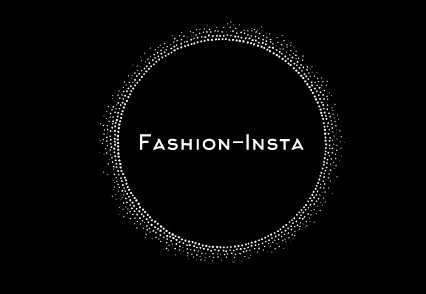

# Fashion-Insta : Application de recommandation de mode

## Introduction

Fashion-Insta est une entreprise de mode qui vend des articles vestimentaires en magasin et en ligne. Nous, l'équipe d'IA, travaillons en collaboration avec Alicia, la VP Produit, pour développer des projets d'IA innovants pour l'entreprise. Le projet phare est la création d'une application mobile de recommandation de mode basée sur des photos prises par les utilisateurs. Cette application utilisera les outils cloud Microsoft Azure pour offrir une expérience de recommandation personnalisée qui améliorera la satisfaction des clients, augmentera les ventes et les revenus de l'entreprise.

## Objectif

Ce README.md vise à fournir une vue d'ensemble claire et concise du projet de l'Application de recommandation de mode de Fashion-Insta, incluant les objectifs, les gains escomptés, les ressources requises et le backlog du projet.

## Objectifs du projet

- Offrir des recommandations personnalisées d'articles de mode en fonction des photos de l'utilisateur
- Améliorer l'expérience utilisateur avec des recommandations personnalisées
- Augmenter la fidélité et la satisfaction des clients
- Augmenter les ventes et les revenus pour Fashion-Insta

## Gains escomptés

- Engagement et rétention accrus des utilisateurs
- Meilleure expérience utilisateur pour une satisfaction accrue des clients
- Amélioration de l'image de marque et de la réputation de l'entreprise
- Augmentation des revenus grâce à une hausse des ventes

## Ressources requises

- Ressources humaines : Développeurs IA, concepteurs, chefs de produit
- Ressources techniques : Outils cloud Microsoft Azure
- Ressources financières : coûts estimés pour le développement de l'application.

## Méthodologie

Le développement du projet se fera en utilisant la méthodologie Agile, offrant ainsi une flexibilité, une meilleure collaboration et une livraison plus rapide.

## Backlog du projet

Le backlog du projet inclut les user stories à développer en priorité. Le MVP (produit minimum viable) comprendra les fonctionnalités clés pour le lancement de l'application. Le backlog sera régulièrement mis à jour en fonction de l'avancement du projet.
